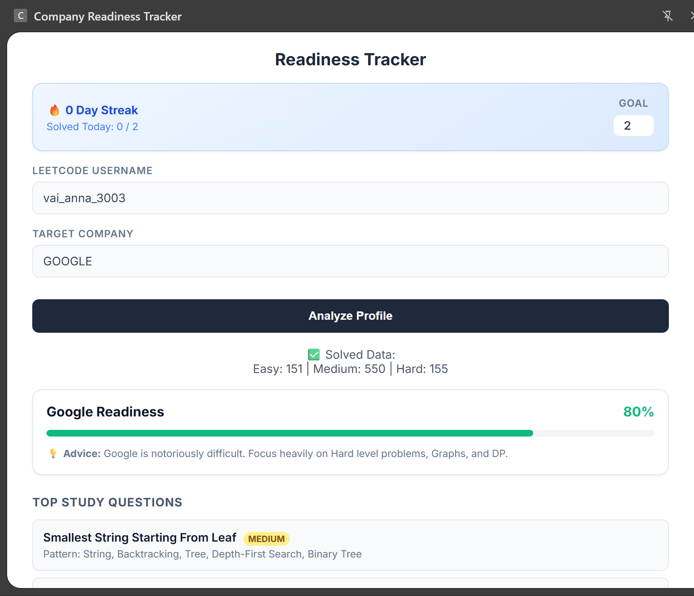
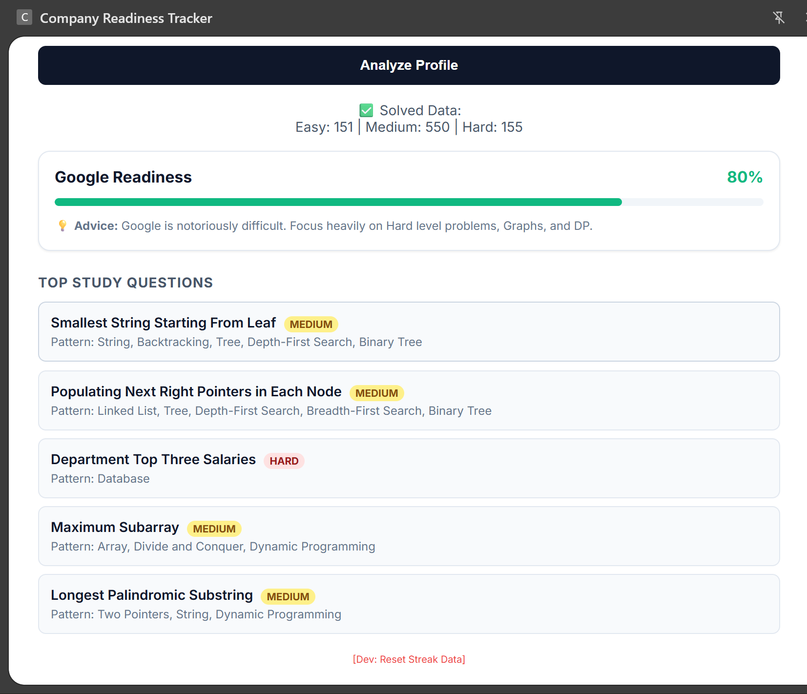

# 🚀 LeetCode Company Readiness Tracker

A full-stack Chrome Extension (MERN) designed to help Software Engineers track their technical interview readiness, enforce daily problem-solving habits, and target specific company requirements using live LeetCode GraphQL data.

## 📌 Overview

Preparing for technical interviews often lacks structure. This extension solves that by acting as a personal, persistent accountability partner right in the browser. It tracks daily goals, calculates a custom "Readiness Score" based on company-specific heuristics, analyzes topic weaknesses, and pulls curated practice questions from a custom MongoDB database. 

## ✨ Key Features

* **Live Profile Analysis:** Directly queries the LeetCode GraphQL API to fetch real-time user statistics, submission counts, and topic mastery.
* **Company Readiness Heuristics:** Calculates a custom readiness percentage for specific companies (e.g., Google, Meta, Amazon) by weighing Easy/Medium/Hard completion ratios against company-specific algorithmic expectations.
* **Smart Weakness Detection:** Analyzes the user's solved tags to identify critical gaps in foundational topics (e.g., Dynamic Programming, Graphs) and flags them for review.
* **Bulletproof Daily Streak Tracker:** Utilizes Chrome's Local Storage API to maintain a strictly enforced daily goal tracker. It handles edge cases like timezone differences, skipped days, and multi-user profile switching without data corruption.
* **Curated Question Database:** Features a searchable autocomplete UI that queries a live Node.js/MongoDB backend containing thousands of company-tagged algorithmic problems.
* **Persistent Side Panel UI:** Built with Chrome Manifest V3's Side Panel API, allowing the app to stay fluid and active across multiple tabs during study sessions.

## 🛠️ Architecture & Tech Stack

This project is built using a decoupled client-server architecture:

**Frontend (Chrome Extension):**
* **Framework:** React.js + Vite
* **Styling:** Custom CSS, Modern UI/UX principles
* **APIs:** Chrome Side Panel API, Chrome Storage API, Chrome Runtime Messaging

**Backend (REST API):**
* **Environment:** Node.js + Express.js
* **Database:** MongoDB Atlas + Mongoose
* **Hosting:** Deployed live on Render

## 🧠 Technical Challenges & Solutions

1. **Manifest V3 CORS & Security:** * *Challenge:* Chrome strictly blocks client-side requests to external domains (like LeetCode's GraphQL API). 
   * *Solution:* Delegated API fetching to a background Service Worker (`background.js`) using `chrome.runtime.sendMessage` and explicitly whitelisted the domains in the `host_permissions` array.
2. **State Management Across Days:** * *Challenge:* A Chrome Extension doesn't run continuously, making it difficult to accurately track if a user met a daily goal or skipped a day while offline.
   * *Solution:* Engineered a custom state-reconciliation algorithm that cross-references the user's current baseline total against deeply stored timestamps (`lastDate`, `startTotal`) immediately upon UI mount, instantly calculating exact progress.
3. **Fluid UI in a Confined Environment:** * *Challenge:* Standard extension popups close automatically on tab switch, disrupting workflow.
   * *Solution:* Migrated the React app to Chrome's newer `sidePanel` API, implementing a fully responsive CSS container that dynamically resizes and persists alongside the user's browser window.

## 🚀 Installation & Local Setup

### To use the Extension (Frontend):
1. Clone this repository: `git clone https://github.com/VaiAnna30/Readiness-Tracker.git`
2. Navigate to the client directory: `cd leetcode-readiness-client`
3. Install dependencies: `npm install`
4. Build the project: `npm run build`
5. Open Google Chrome and navigate to `chrome://extensions/`
6. Enable **Developer mode** in the top right corner.
7. Click **Load unpacked** and select the newly generated `dist` folder.
8. Click the extension icon in your toolbar to open the Side Panel!

### To run the Backend Locally (Optional):
*(Note: The extension is pre-configured to use the live deployed production backend on Render).*
1. Navigate to the server directory: `cd leetcode-readiness-server`
2. Install dependencies: `npm install`
3. Create a `.env` file and add your MongoDB connection string: `MONGO_URI=your_string_here`
4. Start the server: `node server.js`

## 📸 Screenshots

*  *